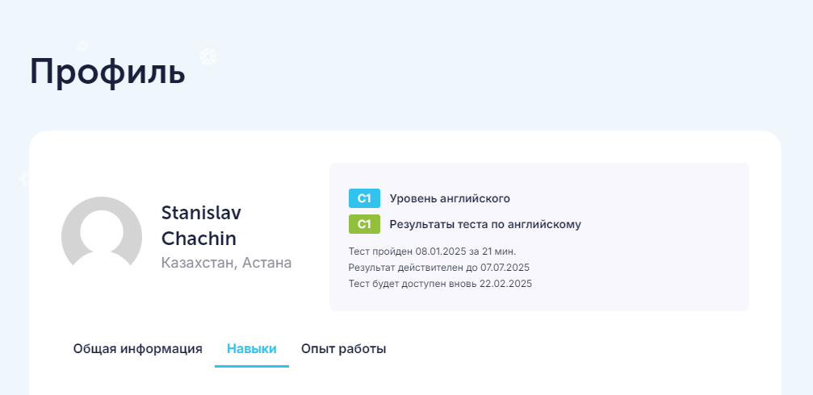

# Stanislav Chachin

## Contacts:

* [t.me/stanrocks](https://t.me/stanrocks)
* [github.com/stanrocks](https://github.com/stanrocks)
* [linkedin.com/in/stanrocks](https://www.linkedin.com/in/stanrocks/)

## About Me

I am a software developer with strong analytical mindset and commercial experience in web development, specializing in JavaScript, TypeScript, React, and related technologies. My current role involves only 20% web development, my goal is to transition into a full-time frontend or full-stack development position.

I joined RS School in January 2025, when it was too late to participate in Stage 1, but I studied independently using the school's materials. I am currently participating in Stage 3 (React).

I am highly motivated, adaptable, and committed to problem-solving. If selected for the RS EPAM Short Track, I am prepared to dedicate 10–12 hours per day, including weekends if necessary, to accelerate my learning. My goal is to secure a Junior position at EPAM, grow into a Middle developer and beyond, contribute effectively to impactful projects. I understand that the Short Track does not lead directly to a Middle position, and my expectations are realistic.

I am very thankful for the opportunity ❤️

## Skills 

* Web Development: JavaScript, TypeScript, React.js, Next.js, Redux Toolkit, Node.js, HTML, CSS, SASS, Tailwind, Git, Github, Chrome DevTools, Figma
* System Administration
* PLC / SCADA Programming

## Code Examples

```
/**
 * Returns the sum of the digits of a given number.
 *
 * @param {number} num
 * @return {number}
 *
 * @example:
 *   123 => 6  // (1+2+3)
 *   202 => 4  // (2+0+2)
 *   5   => 5  // 5
 */
function getSumOfDigits(num) {
  const digitsArr = num.toString().split('').map(Number);
  const sum = digitsArr.reduce((acc, digit) => acc + digit, 0);
  return sum;
}
```

## Work Experience

Educational projects (from recent to older) with the skills used and links to the source code:

* Problem Solving, Research, Teamwork, Self-sufficiency: [PR to rolling-scopes-school:master (approved and merged)](https://github.com/rolling-scopes-school/tasks/pull/1748)
* Git, GitHub, Markdown: [RS School "CV Project" task](https://github.com/stanrocks/rsschool-cv)
* React, TypeScript: [RS School "RS School react app" task](https://github.com/stanrocks/rs-react-app) - repo might be private because of School rules, but I can secretly share.
* JavaScript: [RS School "Human Readable Number" task](https://github.com/stanrocks/human-readable-number/blob/master/src/index.js) - all 1000 tests are green
* JavaScript: [RS School "Core JS numbers" task](https://github.com/stanrocks/core-js-numbers/blob/main/src/numbers-tasks.js) - all 56 tests (including optimal implementations) are green
* TypeScript: ["Mastering TypeScript" course by Colt Steele](https://github.com/stanrocks/typescript_learning)
* TypeScript, Next, Tailwind CSS, Sanity CMS, Firebase: [Portfolio Site (unfinished)](https://github.com/stanrocks/next.js-portfolio)
* React, Redux: ["Modern React with Redux" course by Stephen Grider](https://github.com/stanrocks/Modern-React-with-Redux)
* React, Next: ["The Modern React Bootcamp" course by Colt Steele](https://github.com/stanrocks/Modern-React-Bootcamp)
* JavaScript, Node: ["The Modern Javascript Bootcamp Course" by Colt Steele and Stephen Grider](https://github.com/stanrocks/JS_bootcamp)
* HTML, CSS, JavaScript: ["The Web Developer Bootcamp" course by Colt Steele](https://github.com/stanrocks/WebDevBootcamp_ColtSteele)

Commercial Experience:

* 2020 – 2025, Software Developer: web development (SPAs), full-stack (Next.js, Express.js) and these days mostly frontend tasks, using HTML (Semantic, Accessible), CSS (Adaptive, Mobile-first, Tailwind), JavaScript, TypeScript, React.js (Redux Toolkit, REST APIs), Git, some testing. PLC / SCADA Programming, System Administration. “Center of Complex Automation” LLC.
* 2015 – 2020, Web development, PLC / SCADA Programming. “Engineering technologies” LLC.
* 2012 – 2020, Web development freelance. Sites on Tilda, WordPress, Wix, Squarespace. HTML, CSS, JS, PHP.
* 2008 – 2014, System Administration, Customer Service IT Support, Help Desk / Service Desk. “AVS Group” Holding, “Alliance” LLC, “Uralmash” JSC.

## Education:

2008, Ural State Technical University – Computing Machines, Complexes, Systems and Networks

### Courses:

* Stephen Grider (Modern React with Redux, Typescript: The Complete Developer's Guide, Advanced React and Redux)
* Colt Steele (Web Developer Bootcamp, Advanced Web Developer Bootcamp, HTML & CSS Bootcamp, Modern JS Bootcamp, Mastering Typescript, Modern React Bootcamp)
* HTML Academy

### YouTube:

Rolling Scopes School, The Rolling Scopes, Theo - t3, freecodecamp, Fireship, Beyond Fireship, JavaScript Mastery, Web Dev Simplified, CodeAesthetic, Computerphile, Zach Gollwitzer, Kevin Powell, Yandex for Frontend, Chrome for Developers, JSConf, JetBrains, Andersen People Live

## Language


EPAM Campus English assessment results.

* English: C1

  I have practiced reading, writing, listening and speaking English while working with foreign clients - I've done remote work for clients from USA, Italy, Netherlands, and cooperated on-site with colleagues from Australia.
  
  I have practiced English on international trips, for example, to the UAE or Egypt.

  I practice English daily by watching entertaining and educational content (YouTube, podcasts, articles, courses, books, movies, TV shows, etc.).

* Russian: Native